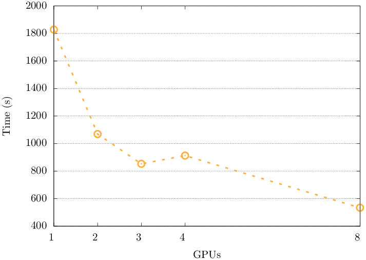

DeepCAM: 
=========

DeepCAM trains a deep learning model to identify extreme weather phenomena in CAM5 simulation data. This case has particular relevance to HPC because it uses high resolution (768x1152) scientific images produced from HPC simulations that have more channels (16) than are typically found in commercial use-cases (3 channels for RGB images).

Datasets: 
* Mini - 64GB
* Full - 8.8TB 

## NERSC-10 Benchmark 

NERSC provide their [own implementation](https://gitlab.com/NERSC/N10-benchmarks/deepcam) with minor modifications to the MLPerf HPC implementation, provides hyperparameter settings (e.g. define a required batch size, learning rate) which must be used for baseline submissions. Submissions are trained to IOU > 0.80, but benchmark performance is evaluated using **time to complete 16 training epochs**. 

| Implementation | #PM GPU nodes | Benchmark <br> Time (sec) |
|---             |---    |---    |
| Baseline       |   256 | 240.0 |
| Baseline       |   512 | 204.0 |
| Optimized      |   512 |  99.2 |

##### Table 1. Showing results for Perlmutter GPU nodes: 1x AMD EPYC 7763 CPU and 4x NVIDIA 40GB A100 GPUs. Using 4x MPI tasks per node i.e. each with 1 GPU and 16 cores. Lammps v23 June 2022 + Kokkos. 

### Hyperparameters: 

Basic definitions: 
* **Batch size** - controls the number of training samples to work through before the model's internal parameters are updated. When training a neural network, we divide the dataset into mini-batches of data points and work through them one-by-one. The choice of a larger batch size is general limited by the hardware resources and available memory.
* **Local batch size** - amount of samples given to each GPU or CPU. 
* **Global batch size** - total amount of samples per epoch. 
* **Gradient accumulation** - a technique used to imitate a larger batch size. Whilst keeping a smaller batch size which fits in the memory of our device, we can save use gradient accumulation to only update the gradients every 2,4,6 iterations instead of every 1. Gradient accumulation modifies the last step of the training process. Instead of updating the network weights on every batch, we can save gradient values, proceed to the next batch and add up the new gradients. The weight update is then done only after *several* batches have been processed by the model. Keep in mind that while gradient accumulation allows you to effectively use larger batch sizes, it may introduce additional noise in the optimization process.


Calculations: 
```bash 
local_batch_size = global_batch_size/num_gpus 
local_batch_size = (global_batch_size/num_gpus)/grad_accum_freq 
```

Typically, hyperparameters of AI models (batch size, learning rate) are finely tuned to each specific architecture and available computational resources. This can be very time consuming and resource expensive. 

To avoid this and compare systems without fine-tuning, we can trial the same parameters on different systems. **The NERSC-10 benchmarking suite defines hyperparameters for a "baseline" (i.e. pre-optimisation) submission [here](https://gitlab.com/NERSC/N10-benchmarks/deepcam/-/blob/main/benchmark/bench_rcp.conf?ref_type=heads).** 


## Setting up DeepCAM 

After [installing PyTorch](scripts/README.md), compile additional dependancies: 

```bash 
git clone https://github.com/mlperf/logging.git mlperf_logging
pip install -e mlperf_logging

conda install -c anaconda h5py
```

DeepCAM - base MLPerf implementation: 
```bash 
git clone https://github.com/mlcommons/hpc.git
cd hpc/deepcam/src/deepCam 
```

For CPU: 
```bash 
Remove line 80 in: ./hpc/deepcam/src/deepCam/utils/bnstats.py
```


# Results

## Cirrus GPUs: 

See [submission script](scripts/run_deepcam_cirrus_gpu.sh) for final list of hyperparameters. 

**NERSC-10 define a global batch size of 2048.** The maximum number of GPUs in a single job on Cirrus is 64. To achieve a global batch size of 2048 on 64 GPUs, the local batch size is 32. However, based on memory constraints, the maximum local batch size is 2. 

We can use a gradient accumulation frequency of 16 and a local batch size of 2 to achieve the desired global batch size. Note: changing the gradient accumulation frequency is also not allowed under the NERSC-10 rules.


### Full dataset

<!-- Submitted on Cirrus: `/work/z04/z04/ebroadwa/benchmarks/deepcam/hpc/deepcam/src/deepCam`
* Full dataset 
* 64 GPU (16 node)
* Currently using local batch size = 1. BUT for NERSC-10: global batch size **must** be 2048, therefore the local batch size should be 32. 

> Currently running at ~ 18 mins per epoch.\
> Perlmutter reports benchmark time (time to 16 epochs) of 240 seconds on 1,024 A100s.\
> 18 mins per epoch = 288 mins (4.8 hours) to 16 epochs on 64 V100s.   -->


| JOBID | #GPUs | local batch size | gradient accummulation | ~ epoch time | time to 16 epochs | 
|-------|-------|-------|-------|-------|-----|
| 5580756   | 64    | 1     | 1     | 19.28 mins | 18739.188 s/312.32 mins | 
| 5583737   | 64    | 2     | 1     | 17.53 mins | 16763.669 s/279.39 mins  | 
| 5592072   | 64    | 2     | 16    | 24.48 mins | Crashed due to disk quota issue on z04 | 

<!-- Note: Timing from the start of epoch 1 to the end of epoch 16.  -->

:warning: With the NERSC-10 hyperparameters, models are not converging on the quality target. 

In comparison, when running with the mini benchmark, the deepCAM quality target (0.82 intersection over union (IoU)) is met at epoch 35 when using default parameters (see [submission script](scripts/run_deepcam_cirrus_gpu.sh) and `./utils/parser.py` in DeepCAM source code). With [the NERSC-10 hyperparameters](scripts/run_deepcam_cirrus_gpu_NERSC10.sh), we reach max epochs (64) without converging. 

:warning: Not clear how changing the global batch size will affect the performance, based on the other fixed hyperparameters and the scale of resources we are limited to. This could be investigated by tuning the hyperparameters to our target architectures, instead of using the NERSC-10 defaults. 


## ARCHER2 CPUs: 

Mimicking the NUMA architecture of the ARCHER2 CPU compute nodes, with `--ntasks-per-node 8` and `--cpus-per-task 16`, we can achieve a global batch size of **2048** with 256 nodes and a local batch size of 1. 

See [submission script](scripts/run_deepcam_archer2_cpu.sh) for final list of hyperparameters. 

> **Preliminary results: average epoch takes 58 mins, not converging with chosen hyperparameters**

> No CPU results for Perlmutter


## ARCHER2 GPUs: 

**Using the mini dataset to demonstrate capability on the ARCHER2 GPUs.**

 

##### Fig 1. Strong scaling speed-up of the mini (61GB) DeepCAM dataset on ARCHER2 GPU nodes. 

Demonstrating multi-node capability. Data loading is a bottleneck for DeepCAM, especially with the reference MLPerf benchmark. 


# Summary: 

Demonstrated that this workload can run on all [listed hardware](../README.md) and run at a scale relevant for exascale HPC systems. 

However, convergence is **not** reached with the baseline NERSC-10 hyperparameters at this scale. We can use this implementation for for demonstrating capability/comparing throughput (i.e. time to epoch) but not accuracy. Reaching target quality/convergence with good performance is something that will need to be explored and tuned on every system. 

What do we want to achieve from running this workload? Do we want to simply demonstrate that it works? Or do we want to show the system is competitive for production runs of these workloads? 