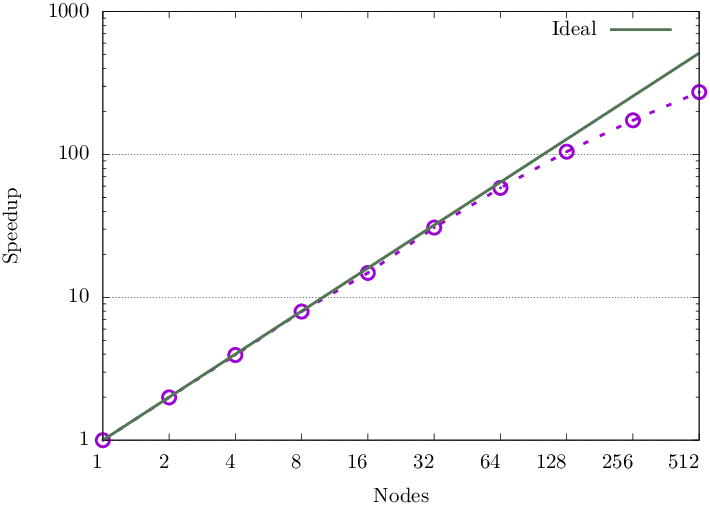
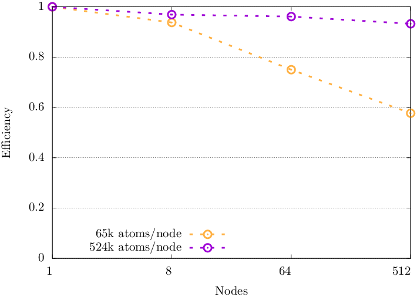
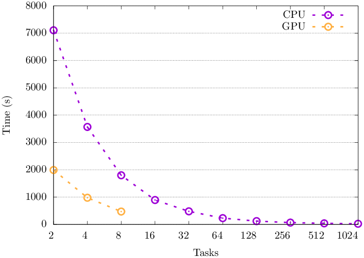
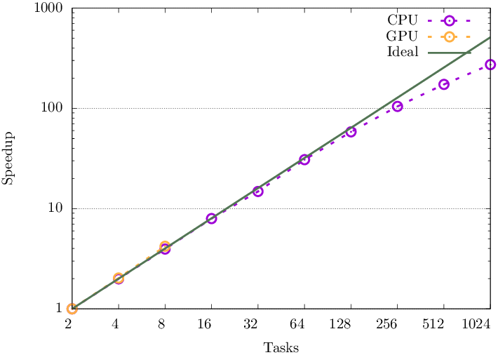

LAMMPS: NERSC-10 Materials by Design Benchmark 
===============================================

[EXAALT](https://gitlab.com/NERSC/N10-benchmarks/exaalt) is an ECP project aiming to optimise MD for exascale, based on a workflow using ParSplice and LAMMPS. 

MD workflows, simulated using LAMMPS, accelerate each time-step by distributing atoms across parallel processing units but keeping the series of time-steps sequential. ParSplice optimises this by managing multiple instances of LAMMPS as a hierarchical task management layer. This introduces parallelism of the time dimension as well as each individual time-step. However, LAMMPS is the performance critical component of the workflow and using **95%** of the EXAALT runtime. So, ParSlice is not included in this benchmark. 

This benchmark simulates the high-pressure BC8 phase of carbon using Spectral Neighbour Analysis Potential (SNAP). 


### Parallel decomposition: 
LAMMPS uses a 3D spatial domain decomposition to distribute atoms amongst MPI processes. The default decomposition divides the simulated space into rectangular bricks. 

## NERSC-10 Benchmark: 
* Input files/batch scripts/Perlmutter outputs for 7 different problem sizes. 
* The collection forms a weak scaling series where each step is 8 x bigger than the previous. 

| Size (atoms)     |  #PM GPU nodes | Total Mem(GB) | #BenchmarkTime(sec) |
| ----      | ---------- | ------------- | ---------  |
| nano (65k)     |    0.25    |      0.14     |      3     |
| micro (524k)    |    0.25    |      0.23     |     25     |
| tiny (4.16M)     |       1    |      1.33     |     54     |
| small (33.6M)    |       1    |      7.32     |    424     |
| medium (268M)   |       8    |      58.6     |    405     |
| reference (2.15B) |      32    |      453.     |    805     |

##### Table 1. Showing results for Perlmutter GPU nodes: 1x AMD EPYC 7763 CPU and 4x NVIDIA 40GB A100 GPUs. Using 4x MPI tasks per node i.e. each with 1 GPU and 16 cores. Lammps v23 June 2022 + Kokkos. 


</br>

# Results 
<!-- ### Perlmutter nano runtime options: 
```bash 
-k on g $gpus_per_node -sf kk -pk kokkos newton on neigh half ${BENCH_SPEC}

-k on g $gpus_per_node = kokkos on with X gpus 
-sf kk = kokkos 
-pk kokkos newton on = turns on pairwise (not bonded) interactions, more computation but less communication
neigh half = determines how neighbor lists are built, a value of half uses a thread-safe variant of half-neighbor lists 
```

### Cirrus nano runtime options: 
* Module ```lammps-gpu/15Dec2023-gcc10.2-impi20.4-cuda11.8```. 

```bash 
-sf gpu -pk gpu $gpus_per_node neigh no

-pk gpu $gpus_per_node = using X gpus 
neigh off = despite the GPU default being to build the neighbor list on the GPU, this is OFF because we are using a "hybrid pair style"
newton off = set Newton pairwise flag off (default for GPUs and required)
``` -->


## ARCHER2 CPU: 
Naive results (i.e copying Perlmutter's balance of 64 tasks-per-node with 2 cpus-per-task) and no repeats. 


 

##### Fig 1. Strong scaling speed-up of the 33.6M atom (small) benchmark on ARCHER2 CPU nodes. 

<!--  

##### Fig 2. weak scaling of lammps on ARCHER2 CPU nodes.  -->

 

##### Fig 2. Weak scaling efficiency. 

</br>

Results show this suite of inputs is suitable for benchmarking LAMMPS on CPUs as they demonstrate good scaling and can be scaled appropriately.  

</br>


## Cirrus GPU: 

Initial testing using the `nano` input: 
* Perlmutter 1xA100 **Kokkos** = 3s (`Performance: 1.373 ns/day, 17.476 hours/ns, 31.790 timesteps/s`)
* Cirrus 1xV100 **Kokkos** = 6s (`Performance: 1.011 ns/day, 23.741 hours/ns, 23.401 timesteps/s`)
* Cirrus 1xV100 **CUDA** = 31 mins (`Performance: 0.002 ns/day, 10271.252 hours/ns, 0.054 timesteps/s, 3.545 katom-step/s`)


### Acceleration in LAMMPS: 

Lammps offers GPU and Kokkos packages to support GPU acceleration. 

The GPU package (compiled for CUDA or OpenCL) only accelerates pair force, neighbor list, and (parts of) PPPM calculations, whereas the Kokkos package attempts to run most of the calculation on the GPU. The GPU package requires neighbor lists to be built on the CPU, which can cause a significant slowdown. 

Perlmutter uses the Kokkos package, and utilises features which are not available with the GPU package. Cirrus module uses the GPU package, built for CUDA, and thus we aren't able to offload as much work to the GPU. 

> :warning: **Potential issue with the benchmark**: If we want to use this benchmark, we will need to use Kokkos for performance. 


</br>

### Comparing Kokkos to CUDA: 

Tests from the [hpc-uk repo](https://github.com/hpc-uk/build-instructions/tree/main/apps/LAMMPS/tests) use standard features available to both Kokkos and CUDA. 

> :warning: **Ongoing...** Attempting to build with Kokkos on Cirrus. Build on the login nodes is so slow it is not possible. Build on the compute nodes also not currently possible because cmake can't find eigen and attempts to build. 

<!-- 
Small tests to prove that the above issue is due to the neighbour list/newton pairing causing a slow down.  

Then run duplicate GPU tests on the ethanol example 
How does it scale? 
Strong scaling kokkos with 1, 2, 4, 8 GPUs 
Weak? 

### Results: 
   

##### Fig 4. Strong scaling of the nano benchmark on Cirrus using the centralised module.  
 
1 GPU: 5571831 - 0:31:18
2 GPU: 5571345 - 0:13:34
4 GPU: 5571339 - 0:06:58
8 GPU: 5571367 - 0:03:24
-->


</br>

## ARCHER2 GPU: 

**Built for AMD/ROCM using Kokkos and HIP.**

Initial testing using the `nano` input: 
* Perlmutter 1xA100 **Kokkos** = 3s (`Performance: 1.373 ns/day, 17.476 hours/ns, 31.790 timesteps/s`)
* Cirrus 1xV100 **Kokkos** = 6s (`Performance: 1.011 ns/day, 23.741 hours/ns, 23.401 timesteps/s`)
* ARCHER2 1xMI210 **Kokkos** = 11s (`Performance: 0.604 ns/day, 39.761 hours/ns, 13.973 timesteps/s, 915.702 katom-step/s`)


### Comparing to ARCHER2 CPU: 


 

##### Fig 3. Strong scaling speed-up of the 33.6M atom (small) benchmark on ARCHER2 CPU nodes. 

 

##### Fig 4. Speed-up. 

</br>
